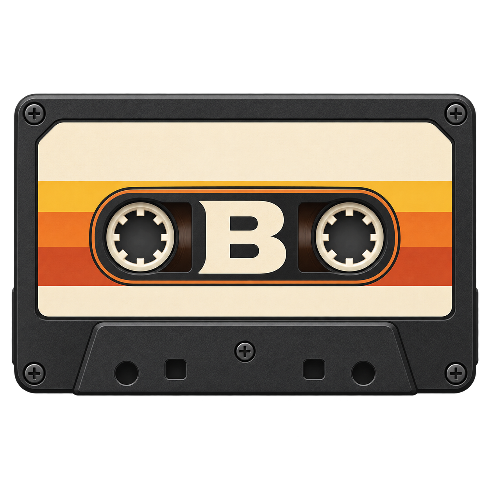
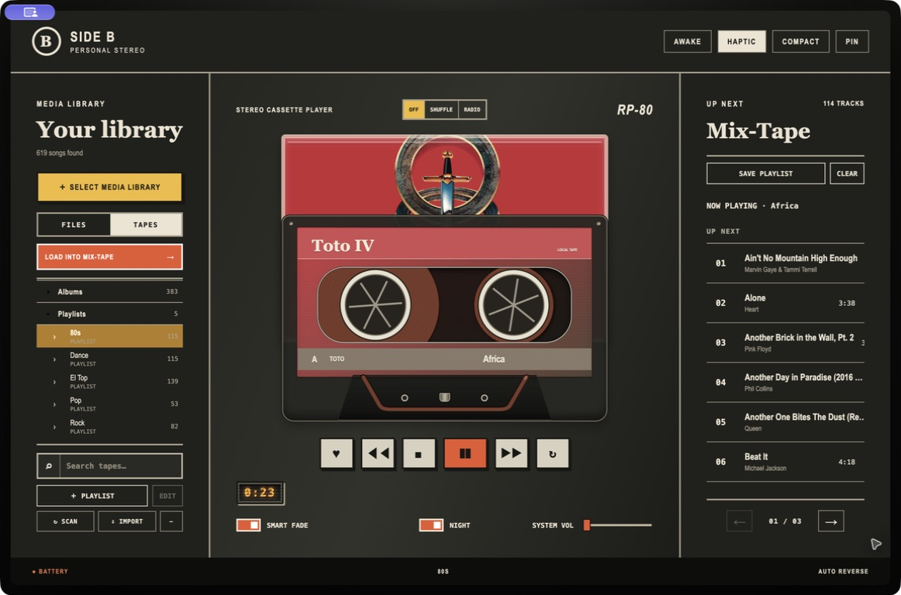
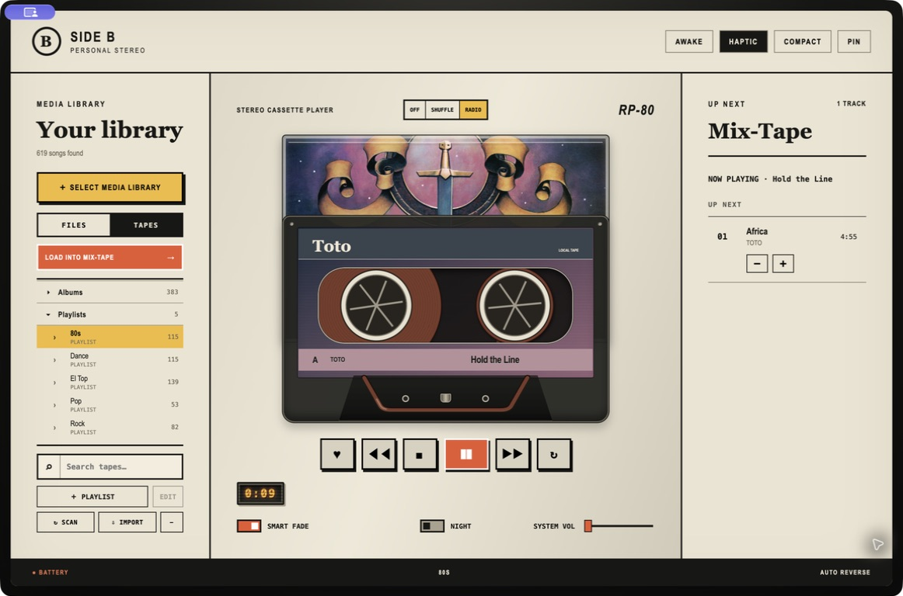

<div align="center">
  
  <h1>Side B</h1>
  <p><strong>Your music, on a new tape.</strong></p>
  <p>A local music player that turns album artwork into a cassette, your library into a shelf of tapes, and the next songs into a Mix-Tape.</p>
  <p>
    <a href="https://github.com/matias7/side-b/actions/workflows/ci.yml"></a>
    <a href="LICENSE"></a>
    
    
  </p>
</div>



Side B gives local files the feel of a physical music collection. The cover shapes each cassette's J-card and colors; the reels move with playback. Music, playlists, library indexes and listening data stay on your computer.

## The listening experience

- **Your library, your tapes.** Scan a folder of local music, browse songs, artists and albums, and import regular playlists from an Apple Music XML export.
- **A Mix-Tape you control.** Queue and reorder songs, save the current tape as a playlist, or clear upcoming tracks without interrupting the song playing now. Scroll above **NOW PLAYING** to revisit this session's listening history.
- **Three ways to listen.** Play the tape in order, switch on Shuffle, or let local Radio keep a recommendation ready using your listening history and explicit Likes.
- **The details of a real player.** Smart Fade can blend transitions; macOS adds media-key and Now Playing support, system volume and trackpad feedback. Light and Night themes, Compact mode and cassette colors change the feel of the deck.



The screenshots show a personal music library. Its songs and album artwork are **not included** with Side B.

## Get started

Side B is currently a beta. For development, use Node.js 24 and npm:

```bash
git clone https://github.com/matias7/side-b.git
cd side-b
npm ci
npm start
```

Choose a music folder in the app, open **Tapes** to browse the indexed collection, then load a selection into the Mix-Tape. Supported library formats are MP3, AAC, M4A/ALAC, WAV, OGG, FLAC and Opus.

On macOS, use macOS 13 or newer on Apple Silicon and install the Xcode Command Line Tools to build the native audio and haptic helpers. Smart Fade analysis needs an external FFmpeg executable. Set `SIDE_B_FFMPEG_PATH`, put FFmpeg on `PATH`, or use Homebrew's default macOS location. FFmpeg is not bundled.

| Platform | Status | Notes |
| --- | --- | --- |
| macOS 13+ / Apple Silicon | Primary development target | Native ALAC playback, Smart Fade and macOS integrations |
| Windows / x64 | Experimental | Electron audio; ALAC needs external FFmpeg; installer and playback still need hardware validation |
| Linux / Intel macOS | No supported release target | Passing unit tests does not establish playback support |

### Playlists and history

Use **＋ PLAYLIST** to create a local playlist. You can search indexed songs, change their order, and keep repeats or an empty playlist. **SAVE PLAYLIST** copies the current song and upcoming Mix-Tape tracks into a new playlist without changing playback. **CLEAR** removes only upcoming tracks and cancels a pending Smart Fade. Both controls are hidden in Radio mode.

The Mix-Tape separates **NOW PLAYING** from **UP NEXT**. Scroll upward once to reach the current song and again to reveal earlier plays. Replaying an earlier entry leaves the upcoming queue intact. This session history clears when Side B quits; listening statistics are stored separately in SQLite.

### Windows notes

Run `npm ci` and `npm start` on Windows x64 with Node.js 24. Windows uses Electron audio; native Smart Fade, macOS Now Playing and trackpad haptics are unavailable. For ALAC, install FFmpeg on `PATH` or point `SIDE_B_FFMPEG_PATH` at `ffmpeg.exe`. Side B converts ALAC losslessly to a temporary FLAC for playback, which may take time to load. Windows volume controls application audio.

## Build and verify

```bash
npm run check
npm test
npm run dist:mac  # macOS ARM64 DMG
npm run dist:win  # Windows x64 NSIS installer
```

Build the installer on its target platform. Release DMGs are made from the `stable` branch after changes from `experimental` are approved and merged. Developer ID signing and notarization are not yet configured as a reproducible release process; see the [public-release checklist](docs/PUBLIC_RELEASE.md). For an unsigned local macOS build, set `CSC_IDENTITY_AUTO_DISCOVERY=false` before building. GitHub CI checks syntax, tests and native compilation on macOS, Windows and Linux without publishing installers.

Side B keeps its SQLite database in Electron's user-data directory, outside the application bundle. Replacing the app does not erase the library or listening statistics. On macOS the usual path is `~/Library/Application Support/Side B/side-b-library.sqlite`; on Windows it is normally `%APPDATA%/Side B/side-b-library.sqlite`.

## Under the hood

Side B uses Electron with a restricted preload API: the renderer handles presentation, while the main process owns the filesystem, SQLite and platform audio. The shared queue rules live in `src/shared/`; macOS helpers live in `native/`. See [GUIDELINES.md](GUIDELINES.md) for the architecture and development rules.

Contributions are welcome through [CONTRIBUTING.md](CONTRIBUTING.md). The [changelog](CHANGELOG.md) tracks releases, [TODO.md](TODO.md) holds the roadmap, and security concerns can be reported through [SECURITY.md](SECURITY.md). Side B is licensed under [GPL-3.0-only](LICENSE); dependency and media licensing notes are in [THIRD_PARTY_NOTICES.md](THIRD_PARTY_NOTICES.md).
